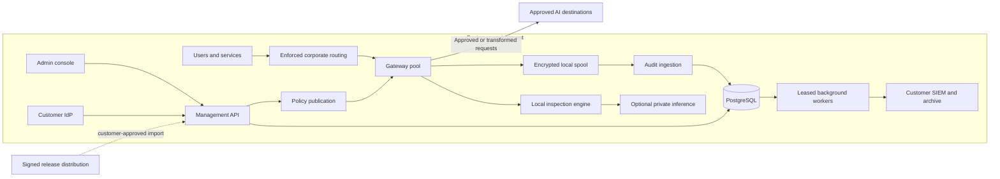

# 03 — System architecture and deployment profiles

# 03 — System architecture and deployment profiles

[Handbook index](README.md)

## System boundaries

Vendor release infrastructure distributes software. It is not part of the default traffic-processing or management runtime. AWS Marketplace licensing connections, when required, form a separately documented commercial dependency.

## Component contracts

| Component | Owns | Must not own |
|---|---|---|
| Gateway | Connections, caller context, local decisions, safe transformation, spool | Global policy edits or customer admin credentials |
| Management API | Configuration, membership, fleet and publication lifecycle | Synchronous forwarding of every inspected byte |
| Policy compiler/signer | Validated immutable bundles and signatures | Unreviewed automatic lowering of mandatory rules |
| Inference adapter | Bounded model requests and structured findings | Arbitrary network tools or unilateral access decisions |
| Audit ingestion | Durable event acceptance and deduplication | Raw prompt capture by default |
| Worker | SIEM delivery, retention, reporting | Multiple uncoordinated claims on the same job |
| Database | Authoritative configuration and event metadata | Hot-path per-token state |
| Object archive | Retained exports/artifacts under policy | Publicly readable customer content |

The logical compiler and signer can initially be modules in the control application with a distinct privilege boundary. The inference adapter may run with the API initially, but gateway concurrency and model resource limits must be independent of admin requests.

## Availability dependencies

The deterministic decision path needs a healthy gateway, trusted client path and valid local policy. Model-dependent rules additionally need the selected inference service. Policy publication needs management and database availability. SIEM delivery needs workers and the SIEM, but queued events can survive temporary SIEM loss.

Do not convert a management failure into unrestricted forwarding. Conversely, do not restart healthy gateways simply because a reporting subsystem is unavailable. Readiness endpoints should expose scoped health: traffic-ready, policy-sync-degraded, audit-degraded and inference-unavailable are different conditions.

## Three deployment profiles

### A. All-in-one

One VM runs the gateway, management API/UI, PostgreSQL and worker. Persistent paths live on a data volume. Optional inference runs externally or on separately sized hardware. Use this for development, pilots and customers accepting single-node downtime. Automated backups must leave the failed node's storage boundary.

### B. AWS HA

Two or more gateways in separate AZs serve an internal TCP load balancer. Separate management nodes serve an internal HTTP load balancer. PostgreSQL has a Multi-AZ configuration. S3, key management and secrets belong to the buyer account. Explicit network paths connect corporate clients and approved providers. See chapter 08.

### C. On-premises HA

Two or more gateway VMs use the customer's TCP load balancer. Management nodes connect to customer-supported PostgreSQL HA and archive storage. The installation contract names the owner of database failover, identity, DNS, time service and backups. Disconnected variants import signed updates and use local destinations/inference. See chapter 09.

## State classification

| State | Location | Restart/failure expectation |
|---|---|---|
| Connection sockets | Gateway memory | Lost on node failure; client reconnects |
| Parsed request | Bounded gateway memory | Discard after completion; never default disk spill |
| Valid policy | Gateway durable cache + control database | Survives restart; signature/version verified |
| Gateway identity | Protected node storage/secret provider | Rotate/revoke; not cloned from an image |
| Audit spool | Encrypted durable node volume | Replay after crash; deduplicate remotely |
| Authoritative team/config data | PostgreSQL | Backup/PITR and migration support |
| Restoration mapping | Scoped memory by default | See conversation-state decision below |
| Long-term archive | Customer object store | Retention, encryption and integrity verification |

## Conversation-state decision

Request transformation sometimes replaces a value with a placeholder and later restores it in the response. The mapping contains the original sensitive value. A multi-node gateway cannot assume subsequent conversation requests reach the same process.

First-release default: support restoration within the active request/connection only unless a protocol adapter explicitly requires and implements conversation state. Cross-request restoration must either use reliable authenticated conversation affinity plus documented node-loss behavior, or a protected shared store with tenant/user/conversation keys and expiry. Connection affinity alone is not conversation affinity.

When mapping is missing, do not guess or reuse another user's mapping. Return a safe incomplete-restoration result or adapter-specific failure. Test forged placeholders and cross-user conversation identifiers.

## Startup and shutdown ordering

Management bootstrap establishes secrets/storage, runs one migration job, initializes deployment identity, then starts API/UI/workers. Gateway startup validates configuration, loads identity and policy, opens spool, verifies TLS material and engine compatibility, then becomes traffic-ready.

For shutdown, mark the gateway draining, stop accepting new work, allow bounded completion of existing requests, persist pending audit records, and stop. Long-lived streams get a documented maximum drain window; a rollout cannot wait forever or promise zero interruption.

## Why this starts without Kubernetes or Kafka

The first release has a small number of services and can use pinned packages/containers under systemd. PostgreSQL plus a durable outbox is enough until measured throughput proves otherwise. Keeping installation small reduces the customer's patching and recovery burden. A future orchestrator or message broker must solve an observed requirement and retain the same data, identity and upgrade contracts.
