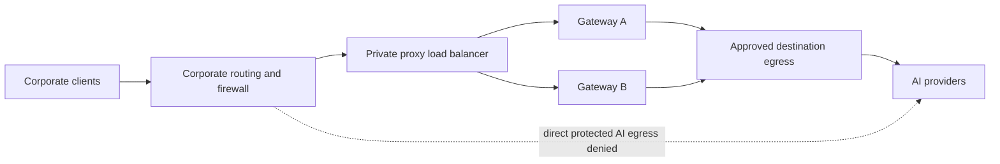
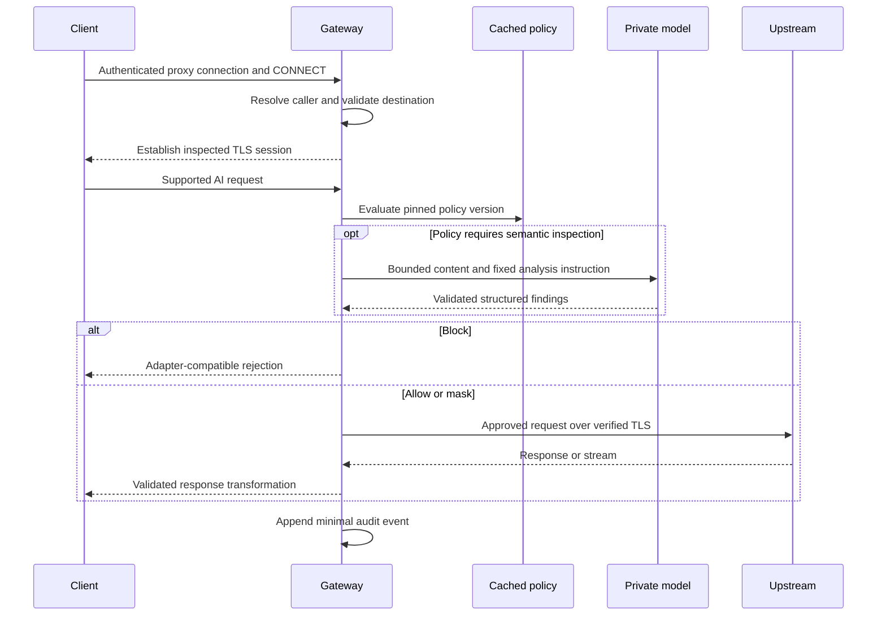

# 04 — Traffic routing, protocol handling and gateway internals

# 04 — Traffic routing, protocol handling and gateway internals

[Handbook index](README.md)

## Recommended first network mode

Build an explicit HTTP forward proxy supporting CONNECT for approved TLS destinations. Configure managed clients to use its private endpoint. Place a TCP load balancer in front of multiple nodes; preserve the proxy protocol through that load balancer. A management reverse proxy is a different service.

Plain CONNECT is a tunnel, not content inspection. For inspected destinations the gateway must accept client TLS using an inspection certificate and establish separate verified upstream TLS. [HTTP CONNECT semantics](https://developer.mozilla.org/en-US/docs/Web/HTTP/Methods/CONNECT).

TLS-protected proxy transport is preferred where clients support it. If a client supports only a plain HTTP proxy endpoint, use a protected corporate path and a supported identity method; do not transmit reusable proxy passwords over an unprotected network. Document each client's proxy and certificate configuration, including applications with their own trust stores.

## Routing topology

A PAC file is configuration, not an enforcement boundary. The customer must close direct outbound paths for protected traffic. Keep non-AI browsing behavior deliberate: either send it to the existing proxy, use explicit tunneling rules, or bypass it through an independently approved route. Do not accidentally route the entire enterprise through an untested gateway.

AI providers may use shared IP/CDN infrastructure. A simple IP list can overblock unrelated services and miss changing destinations. Combine controlled egress, managed DNS/client policy and exact application/destination classification. Record limitations where the customer's network cannot enforce complete routing.

## Connection processing

For a block decision, no original body bytes may already have reached upstream. Do not implement request inspection as a parallel observer after transmission. Streaming request input needs bounded staging or an explicitly unsupported/blocking behavior.

## Destination controls

Evaluate hostnames with canonicalization and exact boundary rules. `example.com.evil.invalid` must not match an `example.com` rule. Validate ports, resolved addresses and redirects. Prevent proxy access to instance metadata, loopback, management listeners, link-local services and unapproved internal networks. Restrict CONNECT independently of the interception list.

For an approved internal AI service, authorize its specific endpoint and identity, rather than permitting all RFC1918 addresses. Address changes need a controlled resolver policy. Resolve and connect consistently so DNS rebinding does not bypass validation. Upstream redirects do not inherit permission blindly.

## Protocol adapter interface

Proposed adapters implement: destination recognition, request extraction, supported-field inspection, transformation, block-response construction, response parsing and audit metadata extraction. Each declares capabilities and a version. Unknown endpoints under a known provider must not automatically be treated as understood.

| Surface | Required handling | Unsupported behavior |
|---|---|---|
| HTTP/1.1 JSON | Parse, inspect, rewrite, repair framing | Block protected malformed body |
| HTTP/2 | Stream isolation and cancellation; no cross-stream context leak | No silent downgrade to uninspected forwarding |
| SSE responses | Parse logical events across arbitrary chunks | Abort safely on unsupported transformation |
| WebSockets | Per-message context, fragmentation and bounded buffers | Explicit block/exemption for unknown protocol |
| Multipart uploads | Field/filename handling, bounded file extraction | Unsupported/encrypted archives blocked or exempted visibly |
| Compressed bodies | Bounded decompression and re-encoding | Reject expansion bombs/unsupported encodings |
| QUIC/HTTP3 | Deferred unless specifically implemented | Controlled TCP fallback where validated, otherwise block |
| Certificate-pinned/mTLS clients | Separate validated integration | Explicit incompatibility, no TLS-validation bypass |

Do not advertise arbitrary document/OCR/archive coverage from existing CSV/JSON/text support. Capability discovery must distinguish a parsed request with zero findings from a request that was never parsed.

## Session and cache isolation

Use context keys containing deployment/tenant, principal, policy version, engine version and conversation where applicable. Never key sensitive caches only by a prompt hash or destination. Expire entries and cap their size; logout/revocation and policy changes invalidate relevant cached decisions.

Response restoration must recognize only placeholders issued in the same authorized scope. A provider-controlled response cannot request arbitrary secrets by emitting fabricated placeholders. Do not restore sensitive content into a subsequent outbound tool request unless that new destination has its own policy decision.

## Resource and error budgets

Set distinct limits for header bytes, compressed bytes, decompressed bytes, parser depth, concurrent tunnels, in-flight inspected bodies, model queue length, per-user rate, destination connection pool and total memory. Make limits observable. A body-preview limit in logging is not a processing-memory limit.

On overload, reject new protected requests before upstream transmission with a retryable, adapter-compatible response. Cancel downstream model work when the client disconnects. Avoid blindly replaying upstream requests: an AI/tool request can have side effects, and uncertain upstream completion makes automatic retry unsafe.

## Identity across a load balancer

The authenticated principal is authoritative. Source IP is contextual evidence and may represent NAT or a corporate proxy. If PROXY protocol is used for original addresses, accept it only from the trusted load balancer and implement its parser explicitly; arbitrary clients must not inject it. Forwarded identity headers are valid only on authenticated trusted-upstream connections and must be stripped from other traffic.

## Transparent deployment: separate future engineering

Linux routed mode needs original-destination recovery, symmetric routing, policy routing, conntrack behavior, MTU/MSS validation and carefully scoped privileges. EC2 routed appliances may require source/destination-check configuration; change this only in the profile designed to forward packets.

GWLB mode additionally requires GENEVE encapsulation/decapsulation and flow symmetry. It is not enabled by adding the existing Go process to a target group. [AWS GWLB setup](https://docs.aws.amazon.com/elasticloadbalancing/latest/gateway/getting-started.html).

Test IPv4/IPv6, QUIC, alternate ports, DNS-over-HTTPS, encrypted client hello, proxy bypass settings and split tunnels as coverage cases. Unsupported paths need documented customer controls, not an assertion that network placement guarantees visibility.
