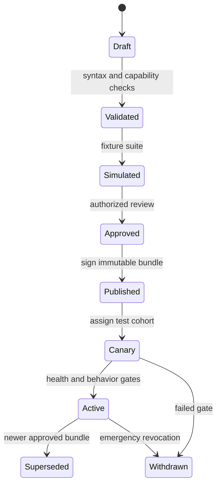

# 06 — Policies, detection, inference and administration

# 06 — Policies, detection, inference and administration

[Handbook index](README.md)

## Policy vocabulary

A policy combines scope, supported destination, data categories, action, execution capability and failure behavior. An action is ALLOW, MASK or BLOCK. A decision also records coverage and enforcement mode. These are separate dimensions: a monitor-mode finding can be “would block” while the request was actually forwarded.

Proposed decision fields: `evaluated_action`, `enforced_action`, `coverage`, `rule_ids`, `policy_version`, `engine_version`, `inference_profile`, `reason_code`. User-facing explanations derive from safe templates, not unrestricted model prose containing customer text.

## Precedence

Recommended precedence is organization mandatory rules → destination restrictions → applicable team/service rules → restrictive default. For conflicting applicable actions use BLOCK over MASK over ALLOW, unless a separately authorized exception explicitly modifies an eligible rule. An ordinary ALLOW rule cannot override a mandatory BLOCK.

Multiple team membership must not depend on array order. Compile the effective rule set deterministically and show its provenance in simulation. Unknown identity receives the unassigned policy, not a guessed team. Missing parser/capability is an error or an explicit exemption, not a clean result.

## Policy lifecycle

Each bundle includes deployment/tenant scope, immutable version, issued/expiry times, minimum compatible engine, rules, destination catalog version, model requirements and signature key ID. Canonicalize the signed representation. Verify scope and signature before loading. Activate atomically and keep one recoverable previous compatible bundle.

A rollback is a new auditable assignment to an approved version; it must not permit an attacker to replay an old bundle indefinitely. Use an assignment generation or authorized rollback record in addition to bundle version. Expiry limits offline operation; choose it deliberately with the customer.

## Drafting and simulation workflow

1. Choose users/services, team and destination scope.
2. Select data categories or write a natural-language rule.
3. Show whether deterministic detection or inference is required.
4. Choose action and behavior for unsupported content/inference failure.
5. Run positive, negative, ambiguous and adversarial synthetic examples.
6. Display the final effective rules, including inherited mandatory constraints.
7. Approve and publish to a pilot gateway cohort.
8. Compare coverage, false positives, latency and queue pressure before expansion.

Exceptions need owner, reason, target, expiry and review history. Expired exceptions should disappear predictably from newly published/activated policies; define whether an urgent removal forces earlier gateway refresh.

## Deterministic inspection

Reuse validated patterns and checksums where available. Treat overlapping findings and Unicode offsets carefully. Transform against the original parsed representation using stable offsets or structured locations; a previous replacement must not invalidate later offsets. Cache only under full identity/policy/engine scope.

Go and Python have separate implementations. Maintain a versioned fixture corpus for promised parity, and document intentional differences. Linux cannot inherit Apple-specific name recognition. Pick a supported Linux alternative and measure behavior before promising equivalent coverage.

## Semantic inspection

The private inference service returns findings under a constrained schema; the policy engine chooses actions. Treat the inspected prompt as untrusted data, including instructions to ignore rules. The model must not receive tool access, arbitrary network permissions or authority to mutate policy.

A supported model profile specifies artifact identity/license, tokenizer, context and chunk limits, output schema, inference parameters, concurrency limit, timeout and detector evaluation results. API compatibility alone does not imply semantic quality. Validate long inputs, multilingual material and malformed model outputs.

Return offsets or structured locations that can be verified against the input. Reject impossible spans, unknown categories or overlapping contradictions that cannot be resolved safely. Never accept model-provided replacement HTML or executable expressions.

## Inference modes

| Mode | Data movement | Capability |
|---|---|---|
| Deterministic only | Stays in gateway | Only policies supported by local detectors |
| Customer-local model | Gateway to private customer endpoint | Validated semantic policies |
| Customer-approved external model | Leaves customer boundary to configured provider | Explicit opt-in, separately documented |
| Model unavailable | No valid semantic decision | Block affected requests unless policy explicitly permits reduced enforcement |

The existing `OPENAI_BASE_URL` setting can help implement a compatible adapter, but the new mode must cover every model call site. Disable demo/sales model routes in the appliance unless intentionally supported. Prove no hidden external fallback with network-denial tests.

## Timeouts and backpressure

Use a total inspection deadline subdivided into parsing, queueing and inference. The gateway rejects or blocks when required analysis cannot complete. Do not let model requests accumulate indefinitely or monopolize the management API. Cancel abandoned work and distinguish timeout from an actual “no findings” result.

Retries may be safe before upstream submission for idempotent model analysis, but must fit the original deadline. They are not permission to replay a possibly completed AI/tool request to the external destination.

## Administrator screens

Required views: deployment health, gateway inventory, policy drafts/versions/assignments, identity mappings, decision search, coverage gaps, integrations, certificate expiry, storage/retention, updates/license and change history. Every gateway row should show assigned and loaded policy versions, last contact and protection state.

Decision search should answer “what happened, for whom, under which rule, and was enforcement actually applied?” A successful TCP connection is not evidence of successful inspection. Coverage metrics must include unsupported and bypassed traffic, not only parsed requests.
