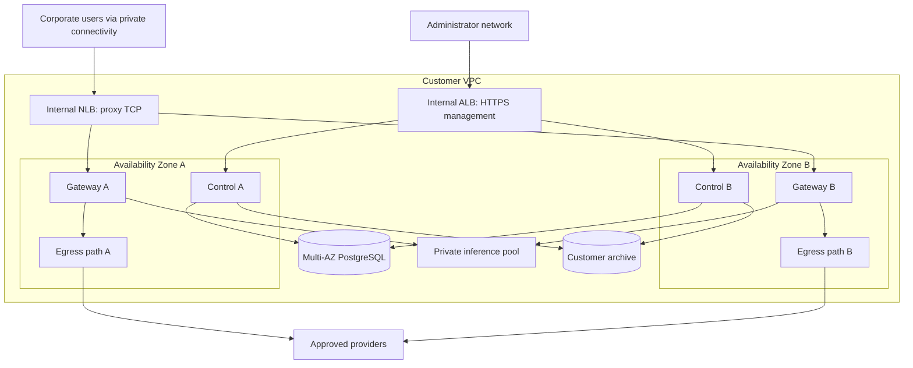

# 08 — AWS infrastructure and installation

# 08 — AWS infrastructure and installation

[Handbook index](README.md)

This is the target design for buyer-account deployment. CloudFormation templates and AMI IDs still need implementation and validation. The existing vendor Terraform must not be applied as a customer deployment template.

## Topology

The diagram is an engineering sketch. Marketplace submission needs its own diagram in the required format with actual deployed resources and current service icons.

## Resource inventory

| Resource | Baseline design |
|---|---|
| Network | Existing VPC integration or dedicated new VPC; nonoverlapping corporate ranges |
| Subnets | At least two AZs; private app/gateway placement and isolated database placement |
| Proxy load balancer | Internal NLB with TCP pass-through where gateways own TLS |
| Management load balancer | Internal ALB; customer DNS/certificate; trusted forwarding headers |
| Gateways | Auto Scaling group, minimum two for HA, immutable launch template |
| Management | Separate two-node group plus coordinated background workers |
| Database | Private Multi-AZ PostgreSQL, encryption, backups, deletion protection |
| Storage | Encrypted EBS per node; private customer bucket for archives/artifacts |
| Secrets/keys | Buyer-owned Secrets Manager/KMS with scoped roles |
| Monitoring | Customer logs/metrics/alarms; bounded retention |
| Connectivity | Customer-approved VPN/Direct Connect/transit path; controlled provider egress |
| Inference | Optional private service with separately benchmarked capacity |

Multi-AZ database failover still interrupts some connections. Applications must reconnect safely and avoid replaying uncertain non-idempotent operations. Do not depend on the local filesystem of one management node for shared downloads or configuration.

## Network rules

Allow corporate client ranges to the proxy listener only. Allow administrator ranges to management HTTPS. Allow gateway identities/network groups to management node endpoints needed for fleet operation. Database ingress is limited to management/worker security groups. No client access to PostgreSQL, inference administration, Docker or diagnostics.

Use private DNS names with customer-issued certificates where appropriate. Ensure remote clients can resolve and reach both proxy and management names over the chosen connectivity. Test corporate/VPC CIDR overlap before launch.

If NLB original-client metadata is needed, verify address preservation/PROXY protocol support against the actual target configuration. TCP pass-through retains gateway TLS handling. [AWS NLB listener documentation](https://docs.aws.amazon.com/elasticloadbalancing/latest/network/load-balancer-listeners.html).

NLB may send traffic to unhealthy targets when all targets are unhealthy. Thus every gateway must enforce its own safe unavailable state; readiness is not the security boundary. [AWS NLB health-check behavior](https://docs.aws.amazon.com/elasticloadbalancing/latest/network/target-group-health-checks.html).

## IAM responsibility split

| Identity | Necessary scope |
|---|---|
| Stack deployer | Create only documented stack resources; acknowledge named IAM creation if applicable |
| Gateway instance | Read its configuration/secrets, write customer telemetry, selected license calls if this role owns licensing |
| Management instance | Its DB/integration secrets, scoped archive objects and signing operation |
| Worker | Delivery credentials and archive paths required for leased jobs |
| Backup operator | Backup/restore resources and required keys; no normal traffic inspection role |
| Vendor support | None by default |

Use temporary role credentials, not customer access keys in setup. Require IMDSv2 and block untrusted proxy destinations from reaching metadata. Container access to metadata should be configured deliberately; simply choosing a hop limit without testing can break required credentials or expose them unnecessarily.

## Egress inventory

List destination, purpose, data class, transport and owner for every outbound dependency. Include IdP, inference, approved AI providers, SIEM, DNS/time, AWS secrets/logging/storage, optional licensing and updates. Prefer scoped VPC endpoints where the selected service/region supports them. Strict private mode does not mean every licensing service has a private endpoint; validate reachability separately.

Avoid making vendor ECR or a public package registry a first-boot dependency. Bundle the tested application artifacts in the image. If a large model is delivered separately, document its checksum, license, storage, installation and activation prerequisites before the customer enables semantic policies.

## CloudFormation interface

Proposed parameter groups: deployment profile, VPC/subnets, corporate/admin CIDRs, DNS/certificate references, instance capacities, encrypted storage capacity, archive/retention, secret references and licensing mode. Validate combinations and avoid default internet-wide management access.

Outputs: management URL, proxy host/port, deployment ID, customer-controlled bootstrap retrieval instructions, resource IDs and health summary location. Never output passwords or private keys. Create readiness signals so stack success means the intended bootstrap completed, not merely that EC2 accepted a launch.

Retain database/data volumes/buckets on stack deletion by default where appropriate, with explicit cleanup instructions. Retention is not a backup. Document retained resource costs and ownership to avoid surprise orphaned resources.

## Installation workflow

1. Subscribe to the correct product/version and review software plus infrastructure charges.
2. Select single-node or HA and existing/new network path.
3. Verify quotas, regions, instance architecture, certificates and corporate reachability.
4. Launch the Marketplace-provided template with scoped deployment privileges.
5. Wait for bootstrap signals; inspect safe diagnostic logs on failure.
6. Retrieve the one-use setup credential through the documented buyer-controlled channel.
7. Complete IdP, trust, policy, inference and retention configuration in the private wizard.
8. Enroll a pilot client and prove block/mask/allow against synthetic upstream data.
9. Enforce direct-egress prevention and verify coverage.
10. Run backup, node-loss and management-outage checks before production expansion.

## Scaling and storage

Scale gateways by active connections, new TLS sessions, inspection latency, memory and model queue pressure, not CPU alone. Scale down with draining. Keep enough spare capacity to handle one AZ/node failure at the contracted workload.

Node-local audit spools need a replacement policy: preserve/replay their volumes where feasible and document whether catastrophic node/volume loss can lose not-yet-uploaded events. An autoscaling group that deletes a spool volume can violate audit expectations even if traffic recovers quickly.

## Cost worksheet

Estimate gateway instances + management instances + optional inference + database + NLB/ALB + EBS/S3/backups + NAT/endpoints + VPN/transit + logs + transfer + software subscription. For each item record region, quantity, duty cycle, unit price date and source. Measure log and cross-AZ traffic instead of treating them as zero.

Do not reuse old free-tier or “free Elastic IP” claims from repository documentation. This handbook deliberately does not quote a monthly cost without a workload, region and current pricing calculation.
