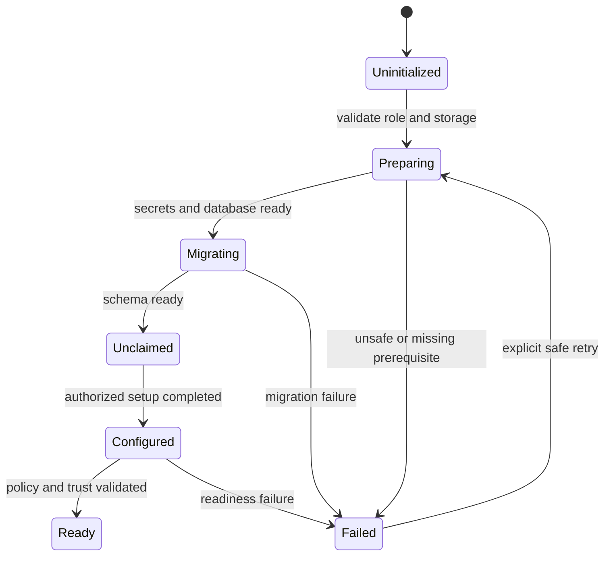

# 10 — AMI build, licensing and Marketplace publication

# 10 — AMI build, licensing and Marketplace publication

[Handbook index](README.md)

## Release artifacts

Create one tested software release and derive AWS/on-premises packages from pinned artifacts. Release identity ties together source revision, binary/container digests, dependency and model licenses, policy schema, database bounds, SBOM, signatures and test evidence. A mutable `latest` tag is not an auditable release identity.

Recommended artifacts: Linux gateway package, API/UI/worker images, appliance service definitions, offline bundle, image-build definition, CloudFormation templates, supported-configuration manifest, migration tools, recovery tools and customer instructions. Create an OVA/QCOW2 format only when the corresponding hypervisor/import path is actually tested.

## Build pipeline

Use isolated CI identities with short-lived permissions. Separate build credentials, signing credentials and Marketplace publication permissions. Prefer an isolated signer with audited approval; never place a release-signing private key in source, container layers or AMI snapshots.

The build should pin base images, runtime packages, Go modules, Python/Node dependencies and model artifacts. Where bit-for-bit reproducibility is not yet achieved, retain build inputs and provenance and describe that limitation accurately. Build without customer data. Test that installation does not download unpinned runtime components.

## AMI image preparation

Select a supported Linux base and x86-64 as the initial tested architecture. Include application artifacts and service definitions. Capture a clean unclaimed state, not a running customer installation. Reset machine identity, logs, temporary files, cloud-init state where appropriate, SSH authorized keys, test users, credentials and generated CA material. Verify first-boot uniqueness by launching two instances and comparing identities and key fingerprints.

Current AWS policy requires a us-east-1 source AMI, supported software, no baked credentials or standing vendor access, and unencrypted source snapshots. Customer launch volumes should be encrypted. Validate scanning and access requirements against the current policy before submission. [AWS AMI requirements](https://docs.aws.amazon.com/marketplace/latest/userguide/product-and-ami-policies.html).

Do not misread an unencrypted distribution snapshot as permission to leave customer data unencrypted. The source snapshot contains software and no tenant secrets; customer keys and data are created after launch on encrypted storage.

## Boot state machine

Persist bootstrap checkpoints atomically. Retry must not reformat storage or overwrite a customer's CA. Setup secrets are unique, short-lived and consumed once. Keep secrets out of EC2 user data, serial/console logs and stack outputs. Provide safe diagnostics and the exact failed stage without exposing credentials.

## Listing and template package

Prefer a small set of well-tested delivery options: single-node pilot and production HA. Existing/new VPC choices can be parameters if complexity remains understandable. Each advertised combination needs clean-account coverage.

CloudFormation should use the Marketplace-supported AMI parameter mechanism, scope IAM, expose validated network settings, provide useful outputs and include a diagram per template. Test all advertised regions. [AWS CloudFormation guidance](https://docs.aws.amazon.com/marketplace/latest/userguide/cloudformation.html).

Prepare product description, software version, architecture, tested instance choices, deployment instructions, usage guide, support contact/process, EULA, privacy/data-flow statement, pricing, network requirements and recovery steps. State exactly which clients/protocols and inference configurations are supported. Avoid “protects all traffic” or “zero configuration” claims.

The listing should distinguish software charges from AWS infrastructure charges, and disclose which nodes consume a paid AMI license. A mandatory vendor sales call cannot be the normal operational step after purchasing a self-service appliance.

## Commercial model decision

AWS offers BYOL, hourly/hourly-annual, contract and usage-based AMI models. Select the model before implementing billing behavior; do not infer Marketplace entitlement from the repository's SaaS trial tables. [AWS AMI pricing](https://docs.aws.amazon.com/marketplace/latest/userguide/pricing-ami-products.html).

| Model | Design impact | Recommended use |
|---|---|---|
| Hourly/hourly-annual | Explain paid instances and HA/scale charges; avoid duplicate in-app billing | Candidate for first appliance offer |
| Contract | Map purchased capacity to application entitlements; coordinate cluster consumption | Enterprise packages when capacity unit is stable |
| Custom metering | Durable usage accounting, retries, time windows, reconciliation and audit | Only when commercial need justifies complexity |
| BYOL | License validation and customer activation; verify listing eligibility/conditions | Deliberate channel strategy, not automatic offline assumption |

AMI contracts use AWS License Manager for entitlement consumption. Define checkout/renewal/release and cluster ownership, including replacement nodes and partitions. [AWS License Manager integration](https://docs.aws.amazon.com/marketplace/latest/userguide/ami-license-manager-integration.html).

Custom-metered AMIs use `MeterUsage` with instance-role credentials. Implement the exact service rules for record identity, retry and allowed reporting windows; a generic SaaS `BatchMeterUsage` flow is not interchangeable. [AMI metering integration](https://docs.aws.amazon.com/marketplace/latest/userguide/custom-metering-with-mp-metering-service.html).

Avoid choosing an arbitrary “requests” dimension before validating the selected Marketplace offering supports the commercial unit. Node-local counters cannot simply be summed after failover if work is retried; define billable events and deduplication independently from diagnostic events.

## Licensing failure behavior

Separate an expired contract, exhausted capacity, temporary network failure and malformed credentials. Expose their states and operator action. Use only an outage/grace policy allowed by the selected offer and implementation. Do not silently turn protection off or forward uninspected content when licensing is unavailable.

For disconnected non-AWS installs, design a signed offline license with deployment binding, features, capacity and validity. Its public verification key ships with the software; its signing key does not. Document renewal import, clock skew, replacement hardware and recovery. A Marketplace listing does not automatically authorize exporting its AMI as an offline VM.

## Submission sequence

1. Establish seller account/business eligibility and responsible release/commercial owners.
2. Choose pricing and delivery modes, supported regions and initial architecture.
3. Build and test the AMI/templates; run required scanning and remediate issues.
4. Create the product/version in the seller workflow and supply required listing artifacts.
5. Test in Limited visibility with a separate buyer account.
6. Validate subscribe, launch, bootstrap, license, upgrade and uninstall paths.
7. Submit for public availability after internal acceptance and AWS review.
8. Monitor release-specific support issues and security findings; maintain patched versions.

AWS documents the Limited-to-public workflow in its [AMI creation process](https://docs.aws.amazon.com/marketplace/latest/userguide/ami-single-ami-products.html). Review requirements again at submission; this handbook does not promise approval or an approval timeline.

## Upgrade and end-of-life policy

Publish release notes, compatibility bounds, maintenance impact and security fixes with every version. Define supported release windows as a product commitment before GA. Restrict unsafe new launches when needed without assuming running customer instances have been upgraded. Communicate remediation through approved customer support channels and preserve documented rollback/recovery paths.
